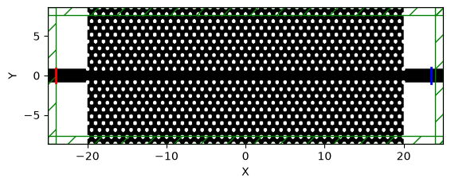
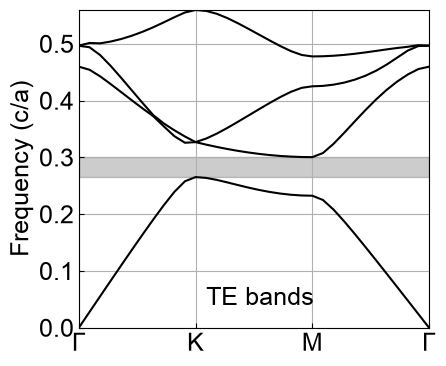
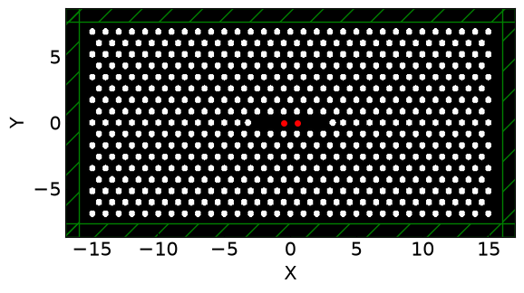
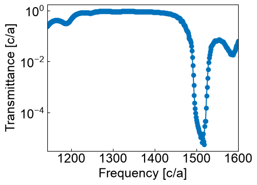

# pymeep_for_phc

Python/Meep を用いて、**2次元近似したスラブ型フォトニック結晶（Photonic Crystal: PhC）**の電磁界解析を行うためのサンプル集です。

時間領域の電磁界計算には [Meep documentation](https://meep.readthedocs.io/en/latest/) / [NanoComp/meep](https://github.com/NanoComp/meep) を使用し、バンド構造計算には Meep に含まれる MPB（MIT Photonic Bands）を使用します。

主な解析例として、次の計算を収録しています。

- フォトニック結晶および W1 導波路の geometry 構築
- MPB によるフォトニックバンド構造計算
- Meep/Harminv による共振周波数および Q 値の抽出
- FDTD フラックス計算による透過率スペクトルの評価

> [!NOTE]
> このリポジトリの2次元計算では、スラブの厚さ方向を有効屈折率で近似しています。多くのスクリプトでは格子定数を `a = 1` とする規格化単位を用い、周波数を `a/λ`（または `ωa/2πc`）で扱います。

## Examples

### W1 photonic-crystal waveguide

[`waveguide/waveguide_w1/waveguide_w1.py`](https://github.com/fdtdengineer/pymeep_for_phc/blob/main/waveguide/waveguide_w1/waveguide_w1.py) は、三角格子状の空気孔列から1列を取り除いた W1 フォトニック結晶導波路を構築する基本スクリプトです。

Gaussian source、PML、対称境界および出力側の flux monitor を設定し、フォトニック結晶を含まない直線導波路を参照計算として透過率を規格化します。



### Band-structure calculation

[`mpb_band/2D_hole_cir.ipynb`](https://github.com/fdtdengineer/pymeep_for_phc/blob/main/mpb_band/2D_hole_cir.ipynb) は、三角格子誘電体中に円形空気孔を配置した2次元フォトニック結晶のバンド構造を MPB で計算する例です。

高対称点 `Γ → K → M → Γ` に沿って波数ベクトルを走査し、TE/TM モードの固有周波数を求めます。

<table>
  <tr>
    <td align="center"><strong>Unit-cell geometry</strong></td>
    <td align="center"><strong>Photonic band structure</strong></td>
  </tr>
  <tr>
    <td></td>
    <td></td>
  </tr>
</table>

### Cavity eigenmode calculation

[`cavity/eigenmode/harminv_cavity.ipynb`](https://github.com/fdtdengineer/pymeep_for_phc/blob/main/cavity/eigenmode/harminv_cavity.ipynb) は、線欠陥型フォトニック結晶共振器を励振し、時間応答を Harminv で解析する例です。

抽出したモードについて、共振周波数、Q 値、減衰率および複素振幅を表形式に整理します。



### Transmittance calculation

[`waveguide/waveguide_w1/waveguide_w1.ipynb`](https://github.com/fdtdengineer/pymeep_for_phc/blob/main/waveguide/waveguide_w1/waveguide_w1.ipynb) は、上記 W1 導波路スクリプトを notebook として実行し、透過率スペクトルを可視化する例です。

フォトニック結晶導波路の出力 flux を、同一条件の直線導波路の出力 flux で割ることで透過率を計算します。



## Repository structure

```text
pymeep_for_phc/
├─ mpb_band/                  # MPB band-structure calculations
├─ waveguide/
│  ├─ waveguide_w1/           # 2D W1-waveguide transmission
│  └─ waveguide_w1_3d/        # 3D W1-waveguide examples
├─ cavity/
│  ├─ eigenmode/              # Harminv resonance/eigenmode analysis
│  └─ transmittance/          # Cavity and waveguide transmission
├─ docs/images/               # Figures copied from notebook outputs for this README
└─ tools/                     # Repository maintenance utilities
```

Individual directories contain exploratory scripts and notebooks for different geometries. The primary entry points listed above are recommended as starting examples.

## Requirements

Typical dependencies are:

- Python 3
- Meep Python interface
- MPB Python interface (`from meep import mpb`)
- NumPy
- pandas
- Matplotlib
- JupyterLab or Jupyter Notebook

Meep installation depends on the operating system and execution environment. Refer to the official [Installation](https://meep.readthedocs.io/en/latest/Installation/) documentation for the recommended Conda or source-build procedure.

## Usage

Clone the repository and move to the target example directory.

```bash
git clone https://github.com/fdtdengineer/pymeep_for_phc.git
cd pymeep_for_phc
```

Run the W1-waveguide Python example:

```bash
python waveguide/waveguide_w1/waveguide_w1.py
```

Or start JupyterLab and open one of the example notebooks:

```bash
jupyter lab
```

The calculations can be computationally expensive. Before a production run, check parameters such as `resolution`, calculation-cell size, PML thickness, source bandwidth and field-decay stopping condition.

## Generated files

Simulation results are normally written below each example's `out/` and `fig/` directories. HDF5 data, CSV data, generated figures, animations and temporary notebook files are excluded by `.gitignore` so that large calculation outputs are not committed accidentally.

The images in `docs/images/` are exceptions: they are exact copies of the embedded outputs in the corresponding notebooks and are tracked only for README documentation.
