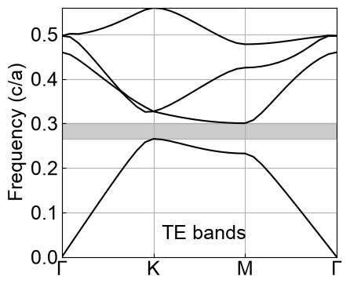
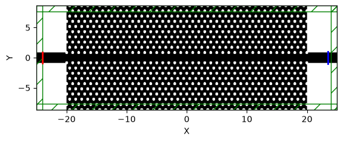
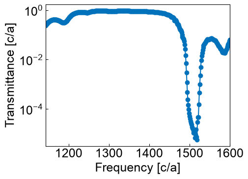
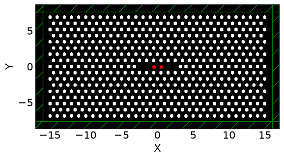

# Photonic-crystal simulations with Meep and MPB

A compact collection of reproducible Python examples for electromagnetic simulations of photonic crystals using [Meep](https://meep.readthedocs.io/) and MIT Photonic Bands (MPB).

The repository focuses on a small set of self-contained examples rather than a history of exploratory scripts. The main workflows are:

- **Band structures** of periodic photonic crystals with MPB.
- **W1 waveguide transmission** with FDTD and reference-flux normalization.
- **Cavity resonances and Q factors** with Meep and Harminv.
- **3D W1 simulations** as a larger standalone FDTD example.

Most calculations use normalized units with lattice constant `a = 1`. Frequencies are therefore reported as `a / λ = ωa / 2πc`.

## Examples

### 1. 2D photonic-crystal band structure

[`mpb_band/band_2d_circular_hole.py`](mpb_band/band_2d_circular_hole.py) computes TE and TM bands for a triangular lattice of circular air holes in a dielectric background along the high-symmetry path `Γ → K → M → Γ`. The displayed figure follows the plotting configuration of the original notebook used to produce the reference image below.

<table>
  <tr>
    <td align="center"><strong>Unit-cell geometry</strong></td>
    <td align="center"><strong>Band structure</strong></td>
  </tr>
  <tr>
    <td></td>
    <td></td>
  </tr>
</table>

### 2. W1 waveguide transmission

[`waveguide/waveguide_w1/waveguide_w1.py`](waveguide/waveguide_w1/waveguide_w1.py) builds a 2D W1 line-defect waveguide and computes its transmission spectrum. The device flux is normalized by a straight-waveguide reference simulation. Numerical and plotting defaults are kept consistent with the original notebook that generated the documentation figures.





### 3. Cavity resonance analysis

[`cavity/eigenmode/harminv_cavity.py`](cavity/eigenmode/harminv_cavity.py) excites a line-defect cavity and uses Harminv to extract resonant frequencies and Q factors from the time-domain response.



### 4. Standalone 3D W1 simulation

[`waveguide/waveguide_w1_3d/trans_3dw1_meep.py`](waveguide/waveguide_w1_3d/trans_3dw1_meep.py) is a larger standalone 3D example. It keeps the geometry generation and Meep conversion logic in one file so that the simulation can be inspected without following project-local dependencies.

## Repository structure

```text
pymeep_for_phc/
├── cavity/
│   └── eigenmode/
│       ├── geometry.py
│       └── harminv_cavity.py
├── docs/
│   └── images/
├── mpb_band/
│   └── band_2d_circular_hole.py
├── requirements.txt
└── waveguide/
    ├── waveguide_w1/
    │   └── waveguide_w1.py
    └── waveguide_w1_3d/
        └── trans_3dw1_meep.py
```

## Requirements

- Python 3.10+
- Meep Python interface
- MPB Python interface (`from meep import mpb`)
- NumPy
- Matplotlib
- pandas for the standalone 3D example

Meep and MPB are best installed from conda-forge. For example:

```bash
conda create -n pymeep -c conda-forge python=3.11 pymeep
conda activate pymeep
pip install -r requirements.txt
```

`requirements.txt` contains the ordinary PyPI dependencies only. Meep/MPB are intentionally omitted from it because the supported installation is normally provided by the conda-forge `pymeep` package rather than a PyPI package named `meep`.

See the official [Meep installation guide](https://meep.readthedocs.io/en/latest/Installation/) for platform-specific alternatives.

## Usage

Clone the repository:

```bash
git clone https://github.com/fdtdengineer/pymeep_for_phc.git
cd pymeep_for_phc
```

Run the 2D band-structure example:

```bash
python mpb_band/band_2d_circular_hole.py
```

Run the W1 transmission example:

```bash
python waveguide/waveguide_w1/waveguide_w1.py
```

Run the cavity resonance example:

```bash
python cavity/eigenmode/harminv_cavity.py
```

For MPI-enabled Meep builds, the larger 3D example can be launched with multiple processes, for example:

```bash
mpirun -np 8 python waveguide/waveguide_w1_3d/trans_3dw1_meep.py
```

## Numerical notes

The 2D FDTD examples model the vertical confinement of a slab through an effective refractive index. They are intended for method development and qualitative/semi-quantitative studies; fully vectorial slab calculations require a 3D model.

Before a production run, convergence should be checked with respect to spatial resolution, PML thickness, simulation-cell size, source bandwidth, and field-decay threshold. The 3D example is substantially more expensive than the 2D examples.

## Generated files

Each example writes generated data and figures to local output directories such as `out/`, `fig/`, or `outputs/`. These directories and common Meep/analysis artifacts are excluded by `.gitignore`.

The figures under `docs/images/` are tracked intentionally for this README. The plotting defaults in the corresponding examples intentionally preserve the original notebook styling so that regenerated figures are directly comparable to these references.
